# Module 11 Challenge
## Forecasting Net Prophet

This is a Jupyter Notebooks project running in Google Colab IDE due to some potential conflicts with module dependencies in Jupyter Lab. 

This is a time series study of MercadoLibre's financial and user data. We are attempting to predict search traffic to see if it translates into success trading the stock. In this project the following analysis is completed:

* Find unusual patterns in hourly Google search traffic
* Mine the search traffic for seasonality
* Relate the search traffic to stock price patterns
* Create a time series model with FB Prophet
* Forecast revenue using time series models

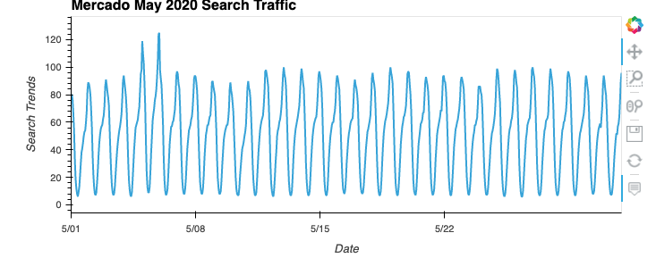
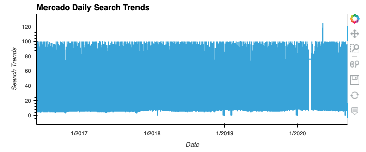
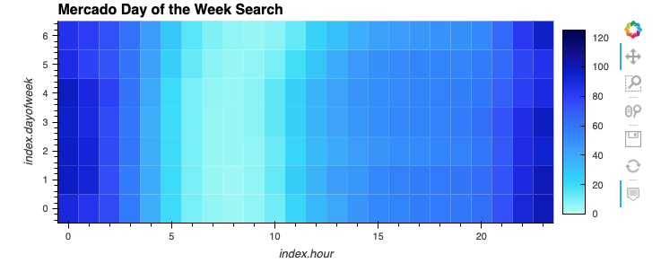
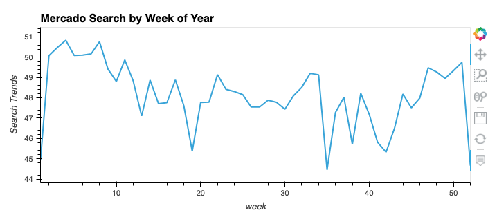
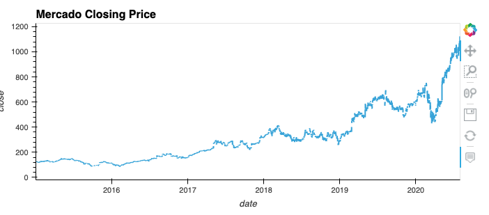
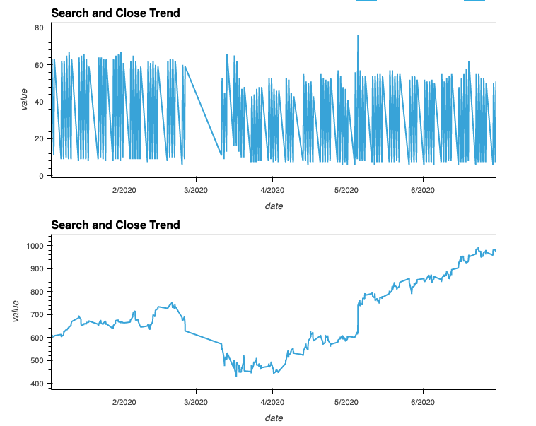
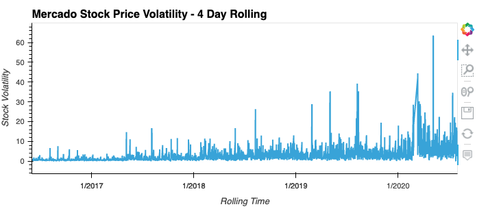
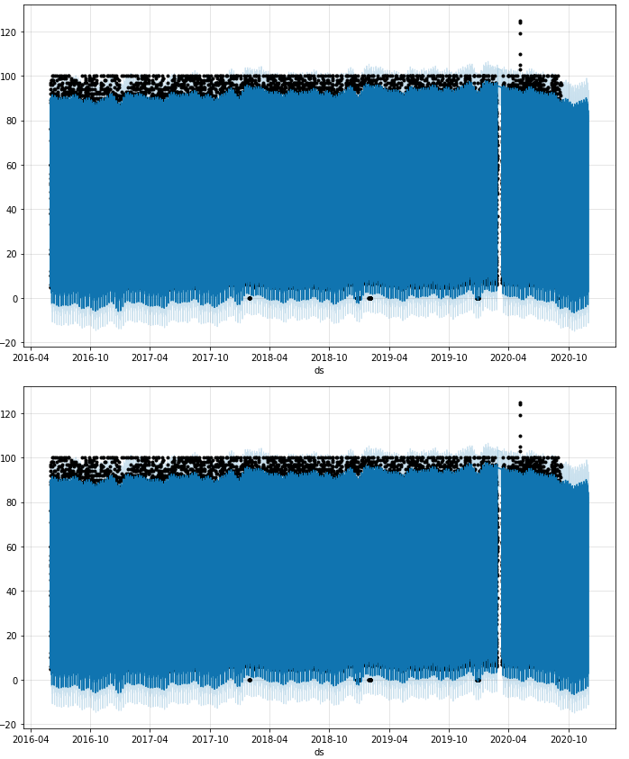
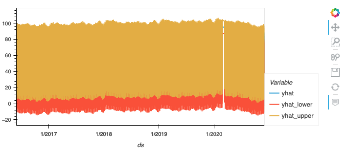
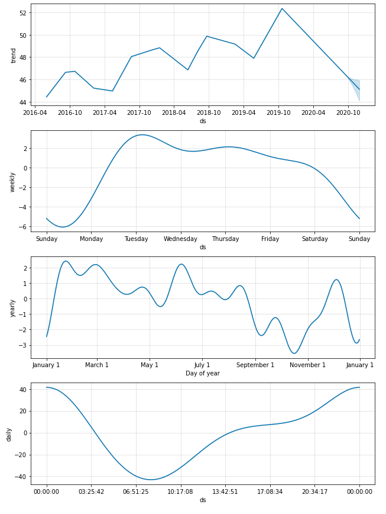
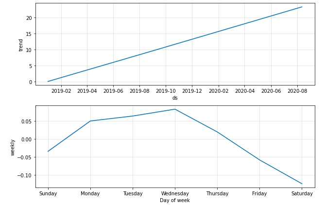


- - - 

## Technologies
### Libraries

The project was buildt using Python 3.7 and several python libraries listed below in a code block. 

In the developers experience, the project seems to run best using Google Chrome and authorizing Github to link to Colab to directly save file to repo.


Use this script to install and import required dependencies
###  Modules
```
# Install the required libraries
from IPython.display import clear_output
try:
  !pip install pystan
  !pip install fbprophet
  !pip install hvplot
  !pip install holoviews
except:
  print("Error installing libraries")
finally:
  clear_output()
  print('Libraries successfully installed')
```
```
# Import the required libraries and dependencies
import pandas as pd
import holoviews as hv
from fbprophet import Prophet
import hvplot.pandas
import datetime as dt
%matplotlib inline
```


### 
- - - 
## Installation Guide
Please see the following installation guides to get started with development environments used in this project

[Python documentation](https://docs.python.org/3.7/)

[Facebook Prophet](https://facebook.github.io/prophet/)

[Google Colab](https://colab.research.google.com)

- - - 
## Contributors
This is a student project 


- - - 
## License
Any usage of this app should be authorized from Columbia Univesity Fintech bootcamp.


