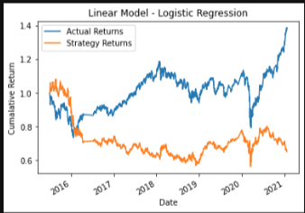

# Module 14 Challenge
## Machine Learning Trading Bot

This project attempts to improve an existing algorithmic trading system. To do so, we've enhanced the  trading signals with machine learning algorithms that can adapt to new data.

To do so we have:

* Establish a Baseline Performance

* Tune the Baseline Trading Algorithm

* Evaluate a New Machine Learning Classifier

* Create an Evaluation Report

- - - 
## Results
### Baseline Model
* Short SMA - 4 Days,  Long SMA Window - 100 Days, DateOffSet - 3 months

### Tuned Model
* Short SMA - 50 Days,  Long SMA Window - 200 Days, DateOffSet - 6 months




### Classfication Report Comparison


Question 1: 
The Recall score for the baseline model is very low and the strategy performance significantly underperforms the actual returns.

Question 2:
There was very little performance gained by increasing or decreasing the SMA windows.

Question 3:
Again there was very little performance improvement by using a different classifer.

Final Conclusion: The models do not seem to have much variation in performance metrics.


### Libraries

The project was created using Python 3.7 and the Python libraries detailed below. 

###  Libraries
```
# Imports
import pandas as pd
import numpy as np
from pathlib import Path
import hvplot.pandas
import matplotlib.pyplot as plt
from sklearn import svm
from sklearn.svm import SVC
from sklearn.preprocessing import StandardScaler
from pandas.tseries.offsets import DateOffset
from sklearn.metrics import classification_report
```

### 
- - - 
## Installation Guide
If you need help with installing Python 3.7 please use this link to Python guides.

[Python documentation](https://docs.python.org/3.7/)


