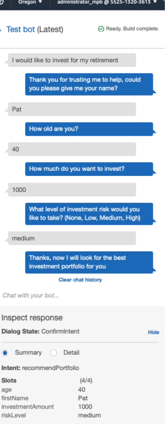
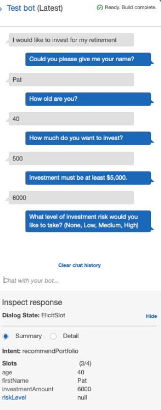
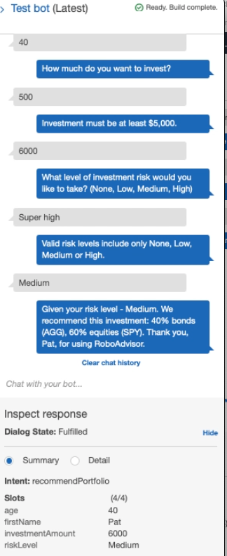

# Module 15 Challenge
## Machine Learning Trading Bot

In this project a RoboAdvisor was created to recommend investments to users during a chatbot session. The RoboAdvisor was created using Amazon Lex and Lambda. 

* Configure the initial robo advisor: Define an Amazon Lex bot with a single intent that establishes a conversation about requirements to suggest an investment portfolio for retirement.

* Build and test the robo advisor: Test that the bot works and accurately responds during the conversation with the user.

* Finally we enhanced the robo advisor with an Amazon Lambda function to create an Amazon Lambda function that validates the user's input and returns the investment portfolio recommendation. We tested the Amazon Lambda function and ensured integrating it with the bot is working properly.
- - - 
## Results

### RoboAdvisor test

### RoboAdvisor enhanced with Lambda Function

## Contributors
This is a student project 

- - - 
## License
Any usage of this app should be authorized from Columbia Univesity bootcamp.

